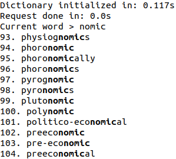

# Testing project for JetBrains Internship: Unreal Editor

This is a testing task for JetBrains Developer Internship 2021: Unreal Editor project.

The task is to develop a fast dictionary search. [The dictionary](https://raw.githubusercontent.com/dwyl/english-words/master/words.txt)
that was used for testing. 

## Dependencies
1. Make, C++

    `sudo apt-get install build-essential`
1. CMake
   
    `sudo apt-get install cmake`
2. ncurses library 

    `sudo apt-get install libncurses5-dev libncursesw5-dev`

##Build & Run
```
git clone <repo>
cmake .
make -j6
./main [Path to dictionary]
```

By default, `[Path to dictionary]` equals to `words.txt`

## Use

Insert any letters or numbers; scroll result with Up\Down keys; press ESC to quit <br>
The first line shows a time that was used for processing all words from a dictionary. <br>
The second line shows a time that was used for calculations when a symbol added\deleted



## Approach
Firstly I took a look at the length of word distribution, and I found that most words have a length of 8-9-10 (60'000 words per each).
<br> Then I wondered what if we precalculate for each combination of two letters all words that include it - how much we will get? 
Turns out that we get at most 76'000 words per combination.
<br> I asked the next question: what if we precalculate for each combination of three letters all words that include it? 
Now per combination, we get at most 24 words! - That became the main idea. <br>
The bottleneck of this solution is precalculating and reading a dictionary. <br>
Memory asymptotic is `O(|S| + |A|^3 + |N|)`, where `|S|` - dictionary size, `|A|` - alphabet size, `|N|` - number of words in dictionary. <br>
Time asymptotic is `O(|S|)` for precalculation and `O(1)` for request.

## User Interface
For designing user-interface I chose ncurses-library (so actually it's CLI instead of GUI)

## Credits
Made by @kuksag ([Telegram](https://t.me/kuksag), [GitHub](https://github.com/kuksag))
